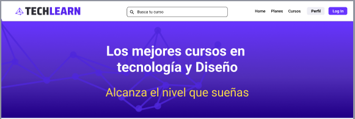
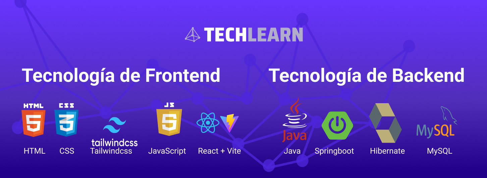

# TechnoLearn-JavaReact

  

## Descripción del proyecto
El proyecto a desarrollar es una plataforma  e-learning que ofrece cursos de tecnología, software, desarrollo y diseño.  Nuestro objetivo es contribuir a la enseñanza de la tecnología digital en Latinoamérica y crear una comunidad entre desarrolladores y diseñadores.

### Solo subire la parte del backend que fue en la que trabajé como desarrollador. 
## Mi trabajo fue: 
Crear la Arquitectura de Software
Ayudar a crear modelo-entidad BBDD
Inicializacion del proyecto, implementacion de dependencias.
Conexion a Base De Datos
Creacion de Registro y Login
Creacion de las primeras APIs Login, Registro, Usuarios.
Creacion de metodo de pago con Stripe y su API.
Manejo de base de datos MySQL

## Stack Tecnologias

  

### Back-End:
 * Java
 * Springboot
 * Hibernate
 * APIrest
 * MySQL
 

 
